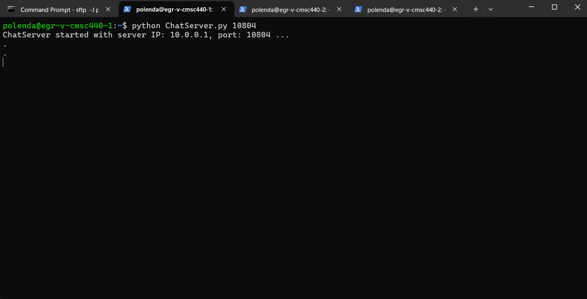
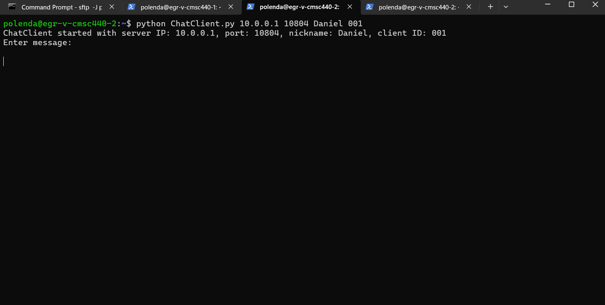
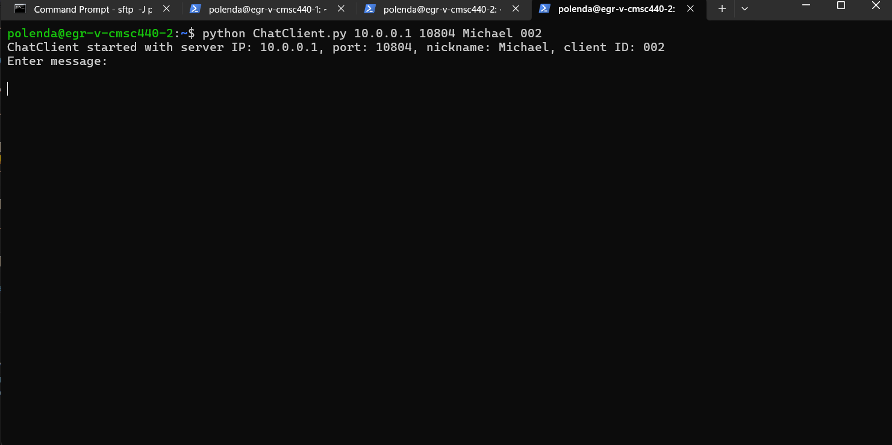
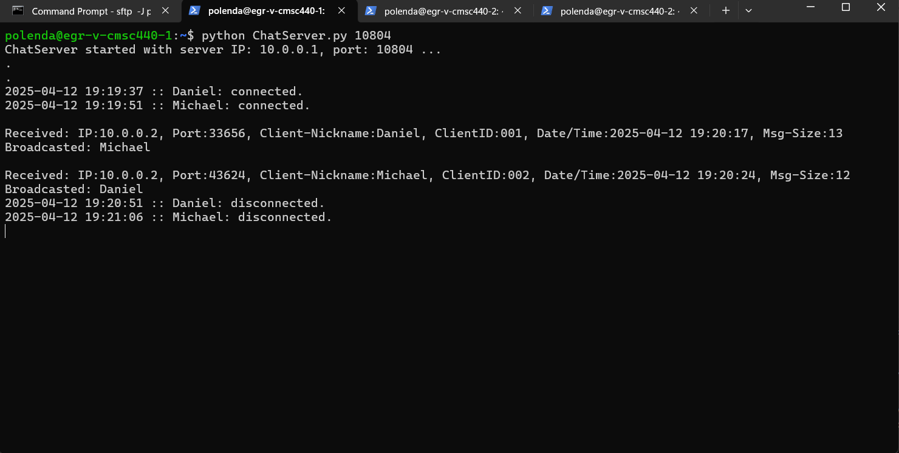
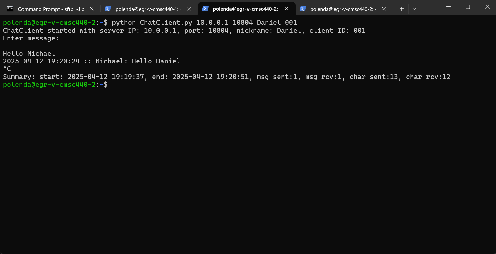
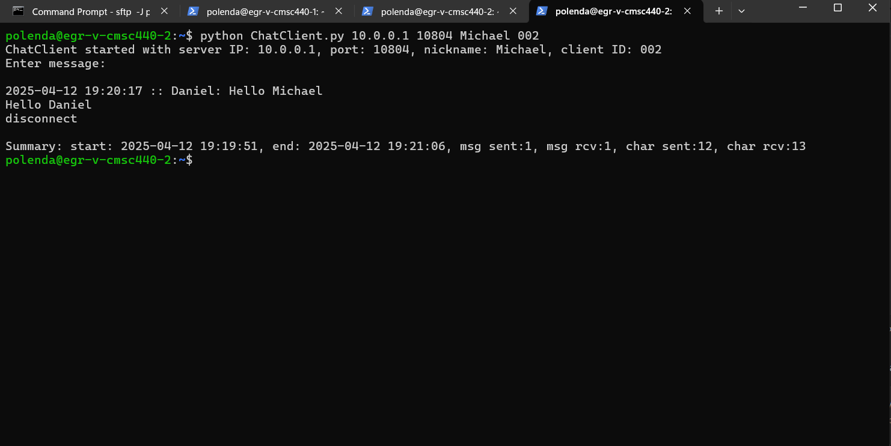

# CMSC-440 Basic Chat Application
 
 

## Description

This project is the deveopment of a basic chat application that is able to run in both local and unix accounts. The project is split between 2 files, ChatServer.py hosts the server systems and ChatClient.py hosts the client systems. 

## Server Requirements
- [X] Connection Management
- [X] Nickname Management
- [X] Message Broadcasting
- [X] Concurrency & Disconnection Handling

## Client Requirements
- [X] Server Connection
- [X] Sending Messages
- [X] Recieving Messages
- [X] User Interface

## How To:

Navigate to where you want your repo.

``` cd ~/path/to/repo/ ```

Clone the repo.

``` git clone repo /Polenda/CMSC-440-basic-chat-app ```

### Server Setup:

Initializing ChatServer.py replacing [port] with the port of your choice.

``` python ChatServer.py [port] ```

Wait for the server to inform you of its start where it provides you with the IP and port.

### Client Setup:

Once the server is up, initialize ChatClient.py and replace [ip] and [port] from the info provided in ClientServer.py then replace [nickname] and [id] with your choice: id is in format ###

``` python ChatClient.py [ip] [port] [nickanme] [id] ```

### Example:

example start up commands and working images within the school unix accounts:

``` python ChatServer.py 10804 ```



``` python ChatClient.py 10.0.0.1 10804 Daniel 001 ```



``` python ChatClient.py 10.0.0.1 10804 Michael 002 ```



#### Client sending an message

Server Snapshot:



Client Snapshots:




